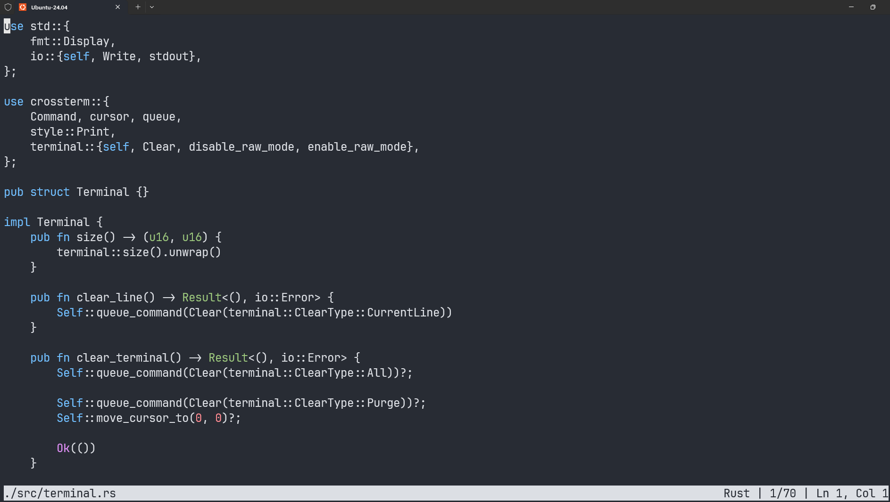

# Editra

A lightweight, terminal-based text editor written in Rust.



## Features

- **Syntax Highlighting**: Currently supports Rust with keyword, type, literal, number, string, character, lifetime, and comment highlighting
- **File Operations**: Open, edit, and save files directly from the terminal
- **Keyboard Navigation**: Full cursor movement support with arrow keys, Page Up/Down, Home/End
- **Status Bar**: Displays filename, file type, cursor position, and line count
- **Unicode Support**: Proper handling of Unicode graphemes and characters

## Installation

Make sure you have Rust installed on your system. If not, install it from [rustup.rs](https://rustup.rs/).

```bash
# Clone the repository
git clone <https://github.com/dipan-ck/Editra.git>
cd editra

# Build the project
cargo build --release

# Run the editor
cargo run --release
```

## Usage

### Opening a file
```bash
cargo run -- path/to/your/file.rs
```

### Starting with a new file
```bash
cargo run
```

## Keyboard Shortcuts

| Shortcut | Action |
|----------|--------|
| `Ctrl+Q` | Quit the editor |
| `Ctrl+S` | Save the current file |
| `Arrow Keys` | Move cursor |
| `Page Up/Down` | Scroll one page up/down |
| `Home` | Move to beginning of line |
| `End` | Move to end of line |
| `Enter` | Insert new line |
| `Backspace` | Delete character before cursor |
| `Delete` | Delete character at cursor |
| `Tab` | Insert tab character |

## Supported File Types

- **Rust** (`.rs`) - Full syntax highlighting
- **Plain Text** - All other file types

## Dependencies

- `crossterm` - Terminal manipulation
- `unicode-segmentation` - Proper Unicode text handling
- `unicode-width` - Character width calculation


<br/>

## Contributing

Contributions are welcome! Feel free to submit issues or pull requests.
